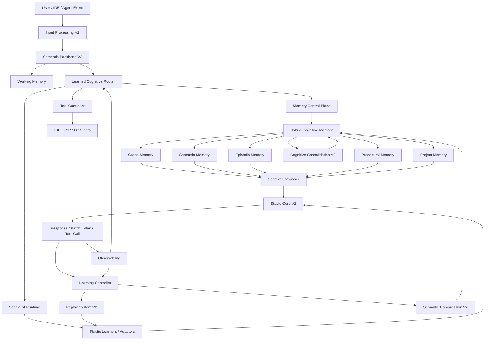
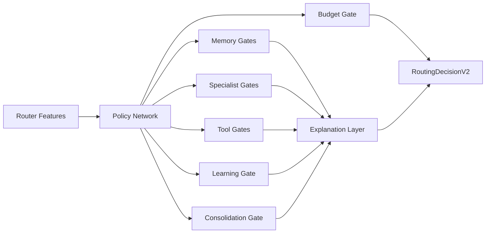
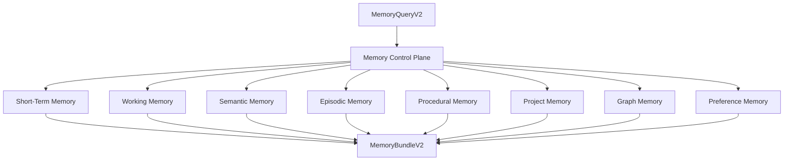
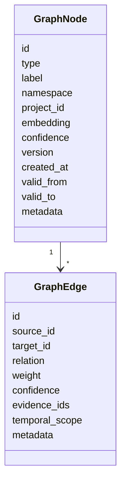
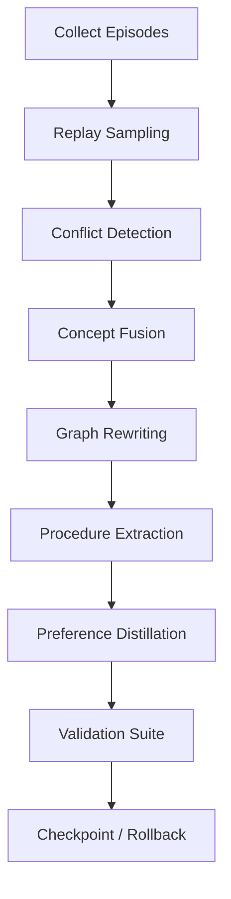
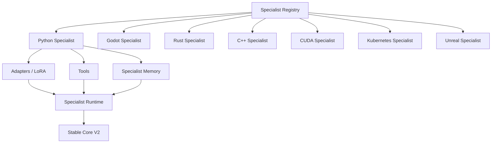
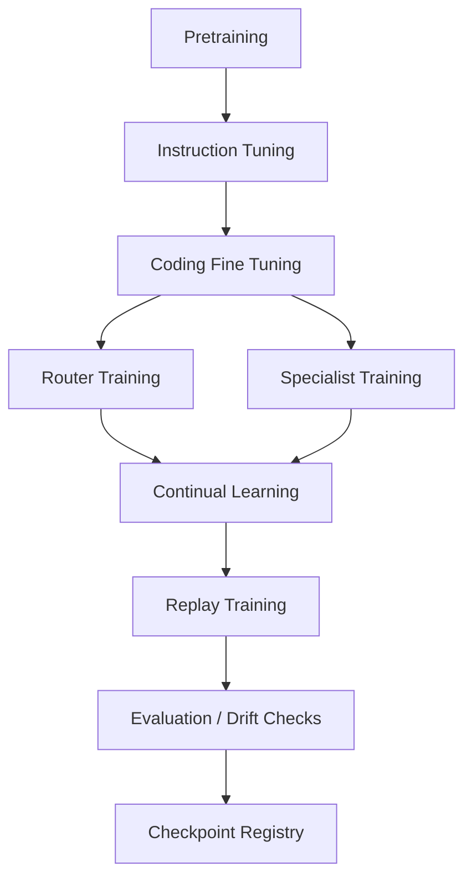

# Cognitive Engine V2

## Evolucion arquitectonica de segunda generacion

Este documento propone una evolucion directa de la arquitectura cognitiva modular actual. No sustituye el sistema por un transformer monolitico y no elimina los principios de V1. La version V2 conserva el `Stable Core`, `Plastic Learner`, `Replay Buffer`, `Consolidation Engine`, `Memory System`, `Dynamic Routing`, `Semantic Compression`, `Registry System`, `Dependency Injection`, `Observability` y `Hot Swapping`, pero los eleva a una plataforma preparada para programacion real, agentes persistentes, memoria de proyectos y especializacion descargable.

La tesis central de V2 es que el sistema debe convertirse en un **Cognitive Runtime**: una plataforma que coordina modelos, memorias, especialistas, herramientas, conocimiento de proyecto y aprendizaje continuo bajo contratos estables. El modelo neural deja de ser "la IA completa" y pasa a ser una pieza dentro de un engine cognitivo versionado, observable y reemplazable.

## Resumen Ejecutivo

V1 demostro que la arquitectura funciona: separa el nucleo estable de la plasticidad, aprende selectivamente, comprime memoria, usa replay, emite trazas y permite hot-swapping. Sus limitaciones principales no son de concepto, sino de escala y sofisticacion: el encoder semantico es pequeno, el routing es heuristico, la memoria es principalmente vectorial, la consolidacion es simple y todavia no existe un subsistema fuerte para entender proyectos de software grandes.

V2 debe introducir seis cambios estructurales:

1. `Semantic Backbone V2`: un backbone moderno y reemplazable con decoder transformer, encoder profundo, hibrido transformer-recurrente o state space model.
2. `Learned Cognitive Router`: un router entrenable que produce decisiones interpretables sobre memoria, especialistas, aprendizaje, contexto y consolidacion.
3. `Hybrid Cognitive Memory`: memoria semantica, episodica, procedimental, de proyecto, de preferencias, de herramientas y de grafos.
4. `Cognitive Graph Memory`: grafo versionado para entidades, conceptos, codigo, dependencias, causalidad, temporalidad y arquitectura de software.
5. `Specialist Runtime`: sistema de especialistas descargables, independientes y conectables para Python, Godot, Rust, C++, CUDA, Kubernetes, Unreal y dominios futuros.
6. `Cognitive IDE Layer`: integracion con IDE, LSP, repositorios, tests, historial de bugs, decisiones arquitectonicas y memoria persistente de proyecto.

La V2 no debe entrenar todo en linea. Debe usar un nucleo estable grande, memorias externas, adapters especialistas, LoRA por dominio, replay selectivo, validacion de memoria y checkpoints reversibles.

## Principios No Negociables

La V2 preserva estos principios de V1:

| Principio V1 | Evolucion V2 |
| --- | --- |
| Stable Core | Stable Core V2 basado en modelo fuerte congelado o slow-update, con interfaces de tool use y grounding por memoria. |
| Plastic Learner | Multiples Plastic Learners por usuario, proyecto, dominio y especialista. |
| Replay Buffer | Replay estratificado por dominio, memoria, proyecto, bug, correccion y skill. |
| Consolidation Engine | Consolidation V2 en fases tipo sleep, replay, fusion, abstraccion y validacion. |
| Memory System | Memory OS hibrido con vector store, graph store, event store, procedural store y project store. |
| Dynamic Routing | Learned Cognitive Router con politicas entrenadas y explicaciones por gate. |
| Semantic Compression | Compression V2 con resumen, extraccion de tripletas, abstraccion, code facts y grafo. |
| Registry System | Registry versionado para modelos, especialistas, memorias, policies y consolidators. |
| Dependency Injection | Composition root mas fuerte para runtime local, servidor, multi-GPU o distribuido. |
| Modular Architecture | Contratos V2 compatibles con adaptadores V1. |
| Observability | Trazas estructuradas, gates, memory reads/writes, drift, costo, latencia, confianza y evaluaciones. |
| Hot Swapping | Reemplazo de especialistas, routers, memorias y backbones sin romper el engine. |

## Diagnostico De V1

### Fortalezas

V1 ya tiene una separacion limpia entre procesamiento, semantica, memoria, importancia, compresion, plasticidad, replay, consolidacion y salida. Esa separacion es valiosa y no debe perderse. La existencia de `EngineBuilder`, `ComponentRegistry`, interfaces abstractas y `replace_component` es la base correcta para crecer.

### Limitaciones

La comprension semantica actual usa un mini encoder hibrido y heuristicas de conceptos. Esto es suficiente para demostrar el pipeline, pero insuficiente para programacion real. Un agente de codigo debe entender dependencias, simbolos, AST, tipos, errores, tests, convenciones y objetivos de usuario.

El routing actual depende de reglas. Eso ayuda a depurar, pero no aprende de resultados. Para competir en tareas reales, el sistema debe aprender cuando recuperar memoria, cuando usar un especialista, cuando ejecutar herramientas, cuando consolidar y cuando no aprender.

La memoria actual esta dominada por embeddings y registros comprimidos. Para proyectos grandes, la memoria debe representar relaciones estructurales: `module imports package`, `function calls function`, `test covers behavior`, `bug fixed by commit`, `decision supersedes decision`, `file owns class`, `API deprecated by version`.

La consolidacion actual fusiona registros similares. En V2 debe convertirse en un proceso multi-etapa que produzca abstracciones, actualice grafos, genere replay, valide contradicciones y construya memoria procedimental.

## Arquitectura V2 Completa



V2 introduce dos planos:

1. `Inference Plane`: procesa la tarea actual, recupera memoria, activa especialistas, compone contexto y produce salida.
2. `Learning Plane`: decide que aprender, donde almacenarlo, como validarlo, como reentrenar adapters y cuando consolidar.

La separacion es critica. El sistema debe responder con baja latencia, pero aprender y consolidar con controles mas fuertes.

## Flujo Interno Detallado

1. Entrada desde chat, IDE, terminal, repositorio, test runner o agente externo.
2. `Input Processing V2` detecta modalidad: texto, codigo, diff, stacktrace, test failure, comando, archivo, AST o evento de IDE.
3. `Semantic Backbone V2` genera representaciones profundas: embedding contextual, conceptos, intencion, entidades, simbolos de codigo y posible grafo parcial.
4. `Working Memory` registra el foco activo: objetivo, archivos abiertos, simbolos relevantes, restricciones y estado de la tarea.
5. `Learned Cognitive Router` decide memoria, especialistas, herramientas, presupuesto y estrategia de contexto.
6. `Memory Control Plane` consulta memoria semantica, episodica, procedimental, de proyecto y grafica.
7. `Specialist Runtime` carga especialistas relevantes: Python, Godot, Rust, C++, CUDA, Kubernetes, Unreal, testing, seguridad, arquitectura.
8. `Tool Controller` puede consultar LSP, AST parser, git, tests, linters, paquetes, docs locales o sandbox.
9. `Context Composer` construye un contexto estratificado: instrucciones, objetivo, memoria relevante, subgrafo, archivos, ejemplos, constraints y evidencias.
10. `Stable Core V2` razona y genera respuesta, plan, patch, comando o tool call.
11. `Learning Controller` evalua la experiencia resultante: exito, fallo, feedback, tests, correcciones, utilidad futura.
12. `Semantic Compression V2` transforma la experiencia en memoria compacta, tripletas, reglas procedimentales y eventos episodicos.
13. `Replay System V2` guarda ejemplos utiles para entrenamiento posterior de routers, especialistas y plastic learners.
14. `Cognitive Consolidation V2` corre en background: fusiona, abstrae, valida, fortalece patrones y elimina residuos.
15. `Observability` registra gates, decisiones, memoria consultada, costo, latencia, confianza, drift y resultado.

## Semantic Backbone V2

La capa semantica debe evolucionar desde un mini encoder hacia un backbone moderno, pero sin convertir el sistema completo en un LLM monolitico. La recomendacion es usar una arquitectura de doble ruta:

1. `Fast Semantic Encoder`: embeddings rapidos para busqueda, routing y memoria.
2. `Deep Contextual Reasoner`: decoder transformer o hibrido moderno para comprension profunda y generacion.

### Opciones

| Opcion | Ventajas | Desventajas | Uso recomendado |
| --- | --- | --- | --- |
| Transformer encoder moderno | Buen embedding contextual, fuerte para retrieval y clasificacion. | No genera texto directamente. | Semantica, routing, memoria, clasificacion. |
| Decoder transformer | Mejor para generacion, tool use, codigo y conversacion. | Atencion cuadratica si no se optimiza; costoso en contexto largo. | Stable Core V2 y razonamiento final. |
| Encoder-decoder | Bueno para transformaciones y resumen. | Mas complejo y menos comun en ecosistemas modernos de agentes. | Compression V2 y consolidacion offline. |
| Transformer + recurrent state | Mantiene estado entre ventanas y conversaciones. | Riesgo de estados opacos y acumulacion de errores. | Working memory, sesiones largas e IDE. |
| State Space Models tipo Mamba | Escala linealmente en longitud y es atractivo para secuencias largas. | Ecosistema menor que transformers; puede ser menos fuerte en razonamiento simbolico abierto. | Prelectura larga, resumen, memoria temporal, logs, trazas. |
| Hibrido Transformer + SSM | Combina razonamiento local/global con eficiencia secuencial. | Ingenieria mas compleja. | Recomendacion para V2 avanzada. |

### Recomendacion

V2 debe usar un `Semantic Backbone` modular con tres implementaciones registrables:

1. `TransformerSemanticBackbone`: baseline fuerte para codigo y lenguaje.
2. `HybridRecurrentBackbone`: decoder transformer con estado recurrente externo para sesiones largas.
3. `SSMPreprocessorBackbone`: SSM o Mamba-like para comprimir logs, repositorios y contextos enormes antes de pasarlos al Stable Core.

No todos deben estar activos al mismo tiempo. El router decide cual usar segun costo, tarea y contexto.

## Stable Core V2

El Stable Core V2 no debe aprender agresivamente en linea. Debe ser un modelo fuerte congelado o actualizado solo mediante ciclos controlados. Para competir en programacion, puede ser:

1. Un decoder transformer especializado en codigo e instrucciones.
2. Un modelo externo via API detras de una interfaz `StableCore`.
3. Un modelo local open-source con adapters congelables.
4. Un ensemble de nucleo general + nucleo de codigo.

El Stable Core recibe contexto compuesto, no memoria cruda infinita. Su input debe estar curado por el `Context Composer`, el `Router` y el `Memory Control Plane`.

## Learned Cognitive Router

V1 usa reglas. V2 debe introducir un router aprendido con interpretabilidad. El router no es un MoE generico; es un **Cognitive Router** que decide acciones del sistema completo.



### Entradas Del Router

El router debe recibir intencion, modalidad, complejidad, entropia semantica, confianza, similitud con memoria, estado del proyecto, historial de especialistas, costos disponibles y riesgo operativo.

### Salidas Del Router

`RoutingDecisionV2` debe incluir:

```python
@dataclass
class RoutingDecisionV2:
    active_modules: list[str]
    selected_specialists: list[str]
    memory_plan: dict[str, float]
    tool_plan: list[str]
    context_budget: int
    compute_budget: float
    learning_action: str
    consolidation_action: str
    confidence: float
    gate_scores: dict[str, float]
    rationale: str
    fallback_plan: str
```

### Entrenamiento Del Router

El router se entrena en tres fases:

1. `Imitation`: copiar heuristicas V1 y decisiones humanas.
2. `Outcome Supervision`: aprender de resultados medibles como tests pasados, patch aceptado, respuesta corregida o memoria util recuperada.
3. `Bandit / RL ligero`: optimizar costo y exito sin perder interpretabilidad.

### Interpretabilidad

Cada decision debe registrar gates activados, top features, memorias consultadas, especialistas candidatos rechazados, costo estimado, confianza y fallback.

## Hybrid Cognitive Memory

V2 reemplaza la memoria principalmente vectorial por una memoria hibrida:



### Semantic Memory

Conocimiento consolidado y relativamente estable. Guarda hechos, definiciones, patrones tecnicos, convenciones del usuario y reglas generales. Usa embeddings, resumen, tripletas y versionado.

### Episodic Memory

Eventos concretos: conversaciones, sesiones de debugging, fallos, fixes, decisiones, ejecuciones de tests. Debe incluir tiempo, proyecto, usuario, contexto, resultado y evidencias.

### Procedural Memory

Patrones de solucion reutilizables. Procedural Memory no es solo texto: debe apuntar a scripts, checklists, tests, tool calls y especialistas.

### Project Memory

Memoria especifica por repositorio: estructura de carpetas, dependencias, modulos principales, decisiones arquitectonicas, bugs previos, fixes, convenciones, comandos de test, riesgos conocidos y propietarios conceptuales de archivos.

### Preference Memory

Memoria de usuario y equipo: estilo de programacion, preferencias de arquitectura, lenguajes favoritos, tolerancia a abstracciones, formato de respuestas, herramientas aceptadas y patrones rechazados.

## Cognitive Graph Memory

Graph Memory es el cambio mas importante para programacion real. Los embeddings recuperan similitud; los grafos representan estructura.

### Modelo De Grafo



### Tipos De Nodos

| Tipo | Ejemplos |
| --- | --- |
| `Concept` | continual learning, replay, dependency injection |
| `Entity` | usuario, repo, modulo, servicio |
| `Project` | cognitive-engine, game-ai, backend-api |
| `File` | `cognitive_engine/core/engine.py` |
| `Module` | `memory`, `routing`, `training` |
| `Function` | `process`, `retrieve`, `consolidate` |
| `Class` | `CognitiveEngine`, `HierarchicalMemorySystem` |
| `Dependency` | torch, pytest, qdrant, chroma |
| `Bug` | failing test, regression, memory drift |
| `Fix` | patch, commit, migration |
| `Decision` | usar registry, congelar stable core |
| `Test` | smoke test, numeric training test |
| `Tool` | pytest, linter, LSP, git |
| `Specialist` | Python Specialist, Godot Specialist |
| `Preference` | respuestas tecnicas, evitar refactors amplios |

### Tipos De Relaciones

| Relacion | Significado |
| --- | --- |
| `imports` | archivo o modulo importa dependencia |
| `calls` | funcion llama funcion |
| `defines` | archivo define clase o funcion |
| `owns` | modulo contiene archivo |
| `uses` | componente usa herramienta o dependencia |
| `fixes` | fix corrige bug |
| `caused_by` | bug causado por cambio o dependencia |
| `depends_on` | modulo depende de otro |
| `conflicts_with` | decision o memoria contradice otra |
| `supersedes` | decision nueva reemplaza una antigua |
| `derived_from` | abstraccion derivada de episodios |
| `observed_in` | hecho observado en sesion, commit o test |
| `temporal_next` | secuencia de eventos |
| `valid_during` | relacion valida durante intervalo |
| `prefers` | usuario o proyecto prefiere patron |

### Grafo Para Proyectos De Software

El sistema debe construir un grafo de proyecto desde AST parsers, LSP, imports, package manifests, tests, git history, issues, stacktraces, documentacion interna y conversaciones previas.

Para un repo grande, el grafo responde preguntas que un vector store solo no maneja bien:

1. "Que archivos se ven afectados si cambio esta clase?"
2. "Que test cubre este comportamiento?"
3. "Que bug anterior se parece a este stacktrace?"
4. "Que decision arquitectonica justifico este modulo?"
5. "Que especialista conviene activar para este archivo?"

### Evolucion Temporal

La memoria de grafo debe ser versionada con `valid_from`, `valid_to`, `commit_id`, `workspace_snapshot_id`, `confidence`, `evidence_ids`, `supersedes` y `contradicts`.

### Graph Retrieval

La recuperacion debe combinar vector search, graph expansion, path ranking, temporal filtering, community summarization y procedural lookup.

## Semantic Compression V2

La compresion V2 debe producir varios artefactos:

1. `CompressedKnowledge`: resumen y conceptos, compatible con V1.
2. `KnowledgeTriples`: sujeto, relacion, objeto.
3. `GraphPatch`: nodos y aristas nuevas o actualizadas.
4. `ProcedureCandidate`: posible memoria procedimental.
5. `PreferenceUpdate`: estilo o preferencia del usuario.
6. `ReplaySampleV2`: ejemplo para entrenamiento posterior.
7. `ValidationRequest`: hecho que requiere confirmacion.

Interfaz propuesta:

```python
class SemanticCompressorV2(KnowledgeCompressor):
    def compress_v2(
        self,
        semantic_state: SemanticStateV2,
        assessment: ImportanceAssessmentV2,
        project_context: ProjectContext | None,
    ) -> CompressionBundle:
        ...
```

## Cognitive Consolidation V2

La consolidacion debe inspirarse en fases tipo sleep:



### Fases

1. `Light Sleep`: corre frecuentemente. Deduplica, actualiza scores, compacta memoria reciente.
2. `Deep Sleep`: corre en idle. Reproduce episodios, fusiona conceptos, extrae procedimientos, reescribe grafos.
3. `REM-like Simulation`: genera escenarios de replay y prueba especialistas contra bugs historicos.
4. `Validation`: verifica memorias contra tests, git, docs y contradicciones.
5. `Commit Memory`: publica memoria consolidada con checkpoint reversible.

## Long Context Architecture

La V2 debe soportar 128K, 256K, 1M y eventualmente 2M tokens. La recomendacion no es meter todo en el Stable Core. La estrategia correcta es jerarquica.

| Arquitectura | 128K | 256K | 1M | 2M | Comentario |
| --- | --- | --- | --- | --- | --- |
| Transformer full attention | Posible con optimizaciones fuertes | Muy costoso | Impractico para la mayoria de despliegues | Impractico | Mejor calidad local/global, costo cuadratico. |
| FlashAttention | Mejora exacta de atencion | Ayuda mucho | No elimina costo conceptual de contexto enorme | No basta sola | Optimiza IO, no resuelve seleccion cognitiva. |
| Sparse Attention | Buena opcion | Buena opcion | Requiere diseno cuidadoso | Compleja | Reduce costo con patrones dispersos. |
| Sliding Window | Eficiente | Eficiente | Pierde dependencias lejanas | Pierde dependencias lejanas | Bueno para logs y codigo local. |
| Recurrent Memory | Buena para sesiones | Buena | Buena si se valida estado | Riesgo de drift de estado | Necesita checkpoints y reseteo. |
| State Space Models | Muy eficiente | Muy eficiente | Atractivo | Atractivo | Bueno para lectura larga; menos probado que transformers para razonamiento abierto. |
| Hybrid RAG + Graph + Long Core | Mejor balance | Mejor balance | Recomendado | Recomendado | Usa contexto largo solo para material ya filtrado. |

### Estrategia Recomendada

V2 debe implementar `LongContextManager`:

1. `Context Triage`: clasifica chunks por relevancia, novedad, autoridad y proximidad.
2. `Hierarchical Summaries`: resumen por archivo, modulo, paquete y proyecto.
3. `Graph Anchors`: nodos relevantes anclan la seleccion de contexto.
4. `KV Cache Store`: conserva estado de sesiones largas cuando sea seguro.
5. `Window Composer`: construye ventanas de 32K, 128K, 256K o 1M segun presupuesto.
6. `Evidence Ledger`: cada fragmento insertado en contexto conserva origen y razon.

Para 128K tokens, retrieval + ventana larga es suficiente. Para 256K, usar compresion jerarquica y grafo. Para 1M, usar lectura distribuida por chunks, SSM/prelectura, graph expansion y solo despues Stable Core. Para 2M, tratar el contexto como dataset, no como prompt: indexar, resumir, graficar, consultar y componer.

## Programming Specialists

Los especialistas son paquetes descargables y versionados. No reemplazan al Stable Core: aportan conocimiento, adapters, herramientas, tests y procedimientos.



### Manifest De Especialista

```yaml
name: python-specialist
version: 2.0.0
domains:
  - python
  - packaging
  - pytest
model_adapters:
  - adapters/python_lora.safetensors
tools:
  - ruff
  - pytest
  - mypy
memory_schema:
  graph_types:
    - Module
    - Function
    - Import
procedures:
  - debug_import_error
  - add_regression_test
compatibility:
  engine_api: ">=2.0"
```

Cada especialista debe tener `SpecialistAdapter`, `SpecialistMemory`, `SpecialistTools`, `SpecialistProcedures`, `SpecialistEvaluator` y `UpdatePolicy`.

## Cognitive IDE Integration

V2 debe poder operar como IDE cognitivo. Esto requiere un `Project Intelligence Layer`.

### Project Understanding

El sistema debe indexar arbol de carpetas, archivos fuente, AST, simbolos LSP, imports, dependencias, test graph, build graph, git history, issues, TODOs y documentacion.

### Project Memory

Debe recordar bugs previos, fixes aceptados, decisiones arquitectonicas, convenciones locales, comandos que funcionan, comandos que fallan, dependencias fragiles, archivos de alto riesgo, preferencias del equipo y estilo del usuario.

### Persistent Coding Intelligence

El agente debe mejorar con el proyecto: entender donde vive cada responsabilidad, evitar fixes rechazados, recordar decisiones, recomendar tests, detectar areas afectadas y aprender convenciones sin modificar Stable Core.

## Learned Personalization

La personalizacion debe vivir en tres capas:

1. `Preference Memory`: hechos explicitos del usuario.
2. `Personalization Adapter`: parametros pequenos por usuario/equipo.
3. `Style Policy`: reglas interpretables de respuesta, codigo y arquitectura.

El Stable Core no se corrompe porque la personalizacion se aplica como contexto, adapter o politica externa.

## Training Architecture V2



### Pretraining

Objetivo: lenguaje, codigo, razonamiento basico y representacion general. Para un proyecto real, lo mas pragmatico es empezar con un modelo base existente y envolverlo con la arquitectura V2.

### Instruction Tuning

Objetivo: seguir instrucciones, conversar, explicar, planificar y usar herramientas. Debe incluir tareas multi-turn, correcciones de usuario y uso de memoria.

### Coding Fine Tuning

Objetivo: programacion real con repositorios, tests, patches, pull requests, issues resueltas, stacktraces, refactors y documentacion tecnica.

### Router Training

Objetivo: aprender acciones del sistema. Labels: memoria consultada fue util, especialista resolvio la tarea, tool call fue necesario, contexto largo ayudo, learning action fue correcta y consolidacion produjo mejora.

### Specialist Training

Cada especialista se entrena con datos del dominio usando LoRA/adapters, memoria tecnica, procedural traces y evaluadores especificos.

### Continual Learning

Debe ser controlado: solo adapters y plastic learners, replay obligatorio, validacion antes de publicar, rollback si baja metrica y separacion por usuario, proyecto y dominio.

### Replay Training

Replay V2 debe muestrear bugs importantes, correcciones humanas, preferencias, casos raros, regresiones historicas, tareas representativas por proyecto y ejemplos donde el router fallo.

## Stability Systems

V2 necesita un `Stability Governor`:

1. `Anti-Drift`: medir cambios de adapters, memoria, politica y evaluaciones.
2. `Anti-Forgetting`: replay estratificado, pruebas historicas y penalizaciones tipo EWC para adapters importantes.
3. `Rollback`: checkpoint por memoria, adapter, router y especialista.
4. `Confidence Scoring`: confianza por respuesta, memoria, routing, especialista y herramienta.
5. `Contradiction Detection`: grafo de conflictos, NLI, reglas simbolicas y validacion con evidencia.
6. `Memory Validation`: cada memoria debe tener origen, evidencia, confianza, fecha y estado.
7. `Quarantine`: memorias inciertas no entran al contexto critico hasta validarse.
8. `Policy Guard`: bloquear aprendizaje ante spam, prompt injection, errores evidentes o datos no confiables.

## Nuevos Modulos E Interfaces

### Tipos Nuevos

```python
@dataclass
class SemanticStateV2(SemanticState):
    code_symbols: list[str]
    graph_candidates: list["GraphPatch"]
    uncertainty: float
    modality_features: dict[str, Any]

@dataclass
class MemoryBundleV2(MemoryBundle):
    procedural: list["ProcedureMemory"]
    project: list["ProjectMemoryRecord"]
    graph_subgraph: "GraphSubgraph | None"
    preferences: list["PreferenceRecord"]
    evidence: list["EvidenceRecord"]

@dataclass
class CompressionBundle:
    compressed_knowledge: list[CompressedKnowledge]
    triples: list["KnowledgeTriple"]
    graph_patch: "GraphPatch"
    replay_samples: list[ReplaySample]
    validation_requests: list["ValidationRequest"]
```

### Interfaces Nuevas

```python
class LearnedRouter(Router):
    def route_v2(self, state: SemanticStateV2, context: "RuntimeContext") -> RoutingDecisionV2:
        ...

class GraphMemoryStore(ConfigurableComponent):
    def apply_patch(self, patch: "GraphPatch") -> None:
        ...
    def query_subgraph(self, query: "GraphQuery") -> "GraphSubgraph":
        ...

class Specialist(ConfigurableComponent):
    def can_handle(self, state: SemanticStateV2) -> float:
        ...
    def prepare_context(self, state: SemanticStateV2, memory: MemoryBundleV2) -> dict[str, Any]:
        ...
    def train_adapter(self, replay: list[ReplaySample]) -> dict[str, float]:
        ...

class LongContextManager(ConfigurableComponent):
    def compose(self, request: "ContextRequest") -> "ContextPackage":
        ...

class StabilityGovernor(ConfigurableComponent):
    def validate_update(self, update: "LearningUpdate") -> "StabilityDecision":
        ...
```

## Migracion Desde V1

La migracion debe ser incremental.

### Fase 0: Compatibilidad

Mantener `CognitiveEngine.process`, tipos V1, tests actuales y agregar adaptadores V1-to-V2.

### Fase 1: MemoryBundleV2

Agregar `GraphMemoryStore` local, `ProjectMemoryStore`, `retrieve_v2` y compatibilidad con `MemoryBundle`.

### Fase 2: Semantic Backbone V2

Agregar interfaz `SemanticBackbone`, wrapper para el encoder actual y emision de `SemanticStateV2`.

### Fase 3: Learned Router

Crear dataset desde trazas V1, entrenar router pequeno, ejecutarlo en shadow mode y compararlo con heuristicas.

### Fase 4: Graph Memory

Indexar estructura del repo, extraer AST/dependencias, crear graph retrieval y usar subgrafos en `Context Composer`.

### Fase 5: Specialist Runtime

Definir manifest, implementar Python Specialist, luego Godot Specialist, adapter loader y evaluaciones por dominio.

### Fase 6: IDE Integration

Conectar LSP, indexar proyecto, registrar bugs/fixes, integrar test runner y persistir Project Memory.

### Fase 7: Consolidation V2

Implementar Light Sleep, Deep Sleep, validation suite y rollback.

## Costes Computacionales

| Componente | Costo pequeno | Costo medio | Costo alto |
| --- | --- | --- | --- |
| Fast encoder | CPU/GPU pequena | GPU unica | Batch distribuido |
| Stable Core | API o modelo 7B | 14B-32B local | multi-GPU |
| Graph Memory | SQLite/NetworkX | Neo4j/Qdrant/pgvector | cluster graph + vector |
| Long Context | 32K-128K | 256K | 1M-2M con preprocesamiento |
| Specialists | adapters pequenos | varios adapters | runtime distribuido |
| Consolidation | idle CPU | GPU batch | jobs programados |
| Router | pequeno MLP | transformer pequeno | policy ensemble |

La decision pragmatica es empezar con modelos externos o locales pequenos, memoria hibrida local, router pequeno y especialistas por adapters. Solo escalar a multi-GPU cuando el valor del sistema este probado.

## Riesgos Tecnicos

| Riesgo | Impacto | Mitigacion |
| --- | --- | --- |
| Router aprendido opaco | Decisiones malas dificiles de depurar | Gate logging, explanations, shadow mode |
| Memoria de grafo inconsistente | Respuestas basadas en relaciones obsoletas | Versionado temporal, evidencia, validacion |
| Contexto largo caro | Latencia y costo excesivo | Context triage, graph anchors, summaries |
| Especialistas incompatibles | Fallos al hot-swap | Manifests, version checks, contract tests |
| Personalizacion corrupta | Respuestas demasiado sesgadas | Preference isolation, rollback, confidence |
| Consolidacion agresiva | Perdida de detalles utiles | Quarantine, validation, episodic retention |
| Replay sesgado | Olvido de casos raros | Muestreo estratificado y auditoria |
| Tool use inseguro | Cambios destructivos | Policy guard, dry runs, approvals |

## Cuellos De Botella

1. Calidad del router: si decide mal, todo el sistema usa mal sus modulos.
2. Extraccion de grafos desde codigo dinamico: Python, Godot y JS pueden dificultar analisis estatico.
3. Consolidacion de memoria contradictoria: requiere validacion fuerte.
4. Latencia de especialistas: cargar adapters y herramientas puede ser costoso.
5. Evaluacion continua: medir agentes persistentes es mas dificil que medir una tarea aislada.
6. Seguridad de memoria: una memoria contaminada puede afectar muchas respuestas futuras.

## Performance Targets

V2 debe aspirar a resolver tareas de codigo multiarchivo con memoria de proyecto, recordar bugs y fixes previos, recomendar tests relevantes, recuperar decisiones arquitectonicas, activar especialistas con precision, mantener coherencia de usuario a largo plazo, evitar drift del Stable Core, reducir costo de contexto largo mediante grafo/compresion, explicar decisiones y permitir rollback de aprendizaje y memoria.

## Roadmap De Implementacion

| Milestone | Duracion estimada | Entregables |
| --- | --- | --- |
| Foundation V2 Contracts | 1-2 semanas | `SemanticStateV2`, `MemoryBundleV2`, `RoutingDecisionV2`, `CompressionBundle`, interfaces y tests de compatibilidad. |
| Project Memory + Graph Memory Local | 2-4 semanas | Indexador de repo, extractor AST Python, graph store local, query de subgrafo y reporte de project understanding. |
| Learned Router Shadow Mode | 3-5 semanas | Dataset desde trazas V1, router pequeno, comparacion con heuristicas, gate logs y activacion experimental. |
| Specialist Runtime | 4-6 semanas | Manifest, Python Specialist, Godot Specialist, adapter loader y evaluaciones por dominio. |
| Cognitive IDE | 6-10 semanas | LSP integration, Git memory, bug/fix memory, test runner integration y project dashboard. |
| Consolidation V2 | 4-8 semanas | Light sleep, Deep sleep, procedure extraction, graph validation y rollback checkpoints. |
| Long Context Manager | 4-8 semanas | Context triage, hierarchical summaries, graph anchors, 128K/256K composer y 1M-mode offline indexing path. |

## Conclusion

La V2 no debe perseguir "un modelo mas grande" como solucion unica. Debe convertir V1 en una plataforma cognitiva con modelos fuertes, routing aprendido, memoria hibrida, grafo de proyecto, especialistas descargables, consolidacion avanzada y estabilidad operacional.

El camino correcto es evolutivo: extender contratos, mantener compatibilidad, introducir memoria de grafo, entrenar routing en shadow mode, agregar especialistas y despues escalar contexto largo. Si se hace asi, el sistema puede competir en tareas reales de programacion y asistencia persistente sin abandonar los principios que hicieron valiosa la arquitectura original.

## Referencias

1. Mamba: Linear-Time Sequence Modeling with Selective State Spaces. https://arxiv.org/abs/2312.00752
2. Longformer: The Long-Document Transformer. https://arxiv.org/abs/2004.05150
3. Big Bird: Transformers for Longer Sequences. https://arxiv.org/abs/2007.14062
4. FlashAttention: Fast and Memory-Efficient Exact Attention with IO-Awareness. https://arxiv.org/abs/2205.14135
5. GPT-4.1 in the API, OpenAI. https://openai.com/index/gpt-4-1/
6. Gemini 1.5: Unlocking multimodal understanding across millions of tokens of context. https://arxiv.org/abs/2403.05530
7. Claude context window documentation. https://support.claude.com/en/articles/8606394-how-large-is-the-context-window-on-paid-claude-plans
8. From Local to Global: A Graph RAG Approach to Query-Focused Summarization. https://arxiv.org/abs/2404.16130
9. Microsoft GraphRAG overview. https://www.microsoft.com/en-us/research/project/graphrag/overview/
10. RAPTOR: Recursive Abstractive Processing for Tree-Organized Retrieval. https://arxiv.org/abs/2401.18059
11. MemGPT: Towards LLMs as Operating Systems. https://arxiv.org/abs/2310.08560

