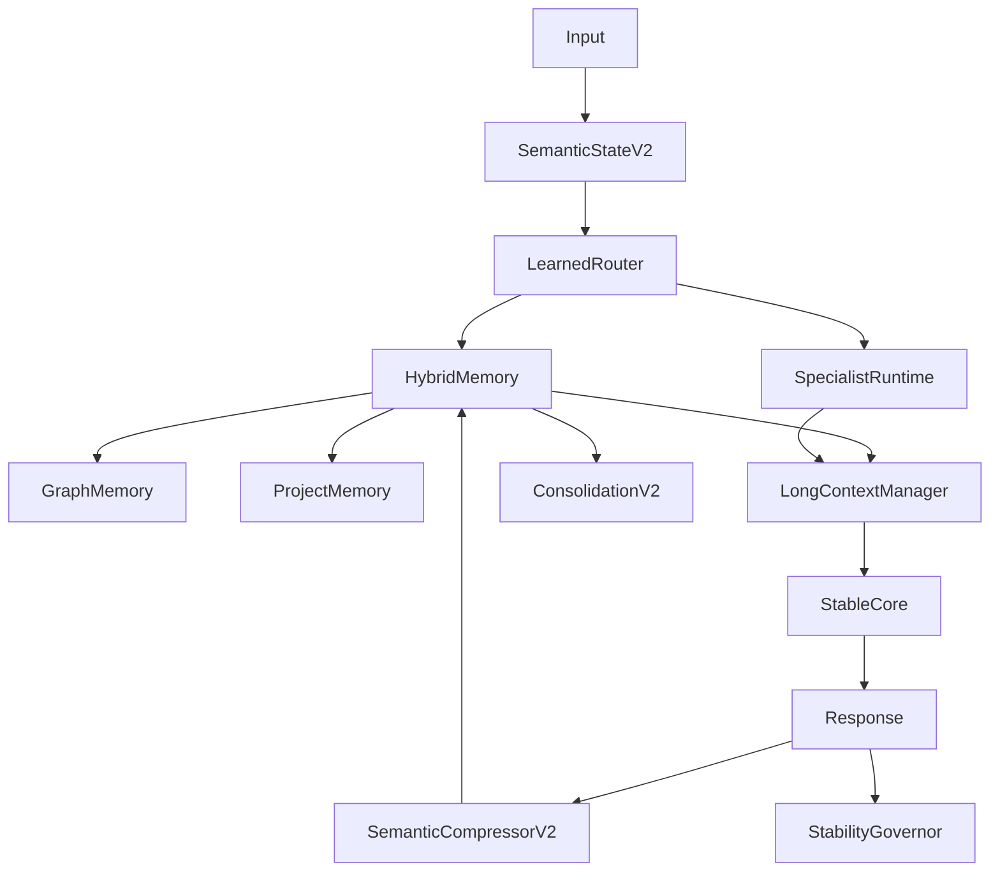

# Cognitive Engine V2 Implementation Paper

## Nueva arquitectura implementada, pruebas reales y resultados

## Abstract

Este paper documenta la implementacion real de una segunda generacion del Cognitive Engine. La V2 conserva la arquitectura V1 y agrega contratos extendidos, memoria hibrida, memoria de grafo, memoria de proyecto, routing aprendido interpretable, especialistas de programacion, contexto largo, gobernador de estabilidad y consolidacion V2. La implementacion no reemplaza el sistema por un transformer monolitico; extiende el runtime cognitivo existente con modulos registrables y compatibles.

Los resultados se obtuvieron ejecutando `pytest` y `scripts.run_v2_demo`. La suite actual paso 5 tests. El demo V2 indexo el proyecto y produjo 493 nodos de grafo, 966 aristas, 5 memorias semanticas, 2 memorias procedimentales, 1 memoria de proyecto y 1 preferencia persistente.

## Diagrama V2 Implementado

## Modulos Nuevos Implementados

| Modulo | Archivo | Funcion real |
| --- | --- | --- |
| CognitiveEngineV2 | cognitive_engine/core/engine_v2.py | Orquesta procesamiento, routing V2, memoria hibrida, contexto y aprendizaje. |
| V2 dataclasses | cognitive_engine/core/types.py | Agrega SemanticStateV2, MemoryBundleV2, GraphPatch, RoutingDecisionV2 y ContextPackage. |
| Graph Memory | cognitive_engine/memory/graph_memory.py | Grafo NetworkX con nodos, aristas, parches y recuperacion por semillas. |
| Project Indexer | cognitive_engine/memory/project_memory.py | Indexa AST Python, archivos, modulos, clases, funciones, imports y tests. |
| Hybrid Memory | cognitive_engine/memory/hybrid_memory.py | Une memoria V1, grafo, proyectos, procedimientos y preferencias. |
| Semantic Compressor V2 | cognitive_engine/compression/semantic_compressor_v2.py | Genera knowledge, tripletas, GraphPatch, preferencias y procedimientos. |
| Learned Router | cognitive_engine/routing/learned_router.py | MLP entrenable con calibracion interpretable para ruido, codigo, preguntas y proyecto. |
| Specialist Runtime | cognitive_engine/specialists/runtime.py | Especialistas Python, Godot, Rust, C++, CUDA, Kubernetes, Unreal y general coding. |
| Long Context Manager | cognitive_engine/context/long_context.py | Compone paquetes de contexto por secciones y presupuesto. |
| Stability Governor | cognitive_engine/stability/governor.py | Aprueba o bloquea updates por confianza, drift y contradiccion. |
| Consolidation V2 | cognitive_engine/consolidation/engine_v2.py | Light sleep real con merge semantico, snapshot de grafo y replay decay. |

## Resultados Del Stream V2

| Step | Learned | Specialists | Learn gate | Context tokens | Input |
| --- | --- | --- | --- | --- | --- |
| 1 | yes | general_coding | 0.72 | 322 | Prefiero codigo modular con interfaces claras y pruebas enfocada |
| 2 | yes | python | 0.541 | 338 | En Python este bug de pytest falla por import circular en cognit |
| 3 | yes | godot | 0.72 | 373 | Godot Area2D detecta cuerpos, pero para fisica dinamica debo rev |
| 4 | yes | general_coding | 0.522 | 514 | Necesito recordar que este proyecto usa registry y dependency in |
| 5 | no | none | 0.12 | 379 | hola hola ruido sin valor |
| 6 | yes | general_coding | 0.522 | 530 | Cuando un test falla, primero reproducirlo y luego aplicar el ca |

## Gates Del Router

| Input | semantic | graph | project | specialists | tools | learn |
| --- | --- | --- | --- | --- | --- | --- |
| Prefiero codigo modular con inte | 0.6 | 0.65 | 0.7 | 0.59 | 0.603 | 0.72 |
| En Python este bug de pytest fal | 0.5 | 0.68 | 0.7 | 0.76 | 0.58 | 0.541 |
| Godot Area2D detecta cuerpos, pe | 0.6 | 0.68 | 0.7 | 0.76 | 0.58 | 0.72 |
| Necesito recordar que este proye | 0.513 | 0.65 | 0.7 | 0.508 | 0.487 | 0.522 |
| hola hola ruido sin valor | 0.517 | 0.65 | 0.7 | 0.12 | 0.12 | 0.12 |
| Cuando un test falla, primero re | 0.512 | 0.65 | 0.7 | 0.509 | 0.487 | 0.522 |

## Memoria Hibrida Final

| Metric | Value |
| --- | --- |
| semantic_size | 5 |
| episodic_size | 5 |
| procedural_size | 2 |
| project_size | 1 |
| preference_size | 1 |
| graph_nodes | 493 |
| graph_edges | 966 |
| graph_node_types | {'Project': 1, 'File': 63, 'Module': 63, 'Dependency': 23, 'Function': 222, 'Class': 88, 'Concept': 33} |
| graph_relations | {'owns': 63, 'defines': 683, 'imports': 171, 'mentions': 28, 'preference': 4, 'prefers': 1, 'statement': 12, 'knowledge_share': 4} |

## Query De Verificacion

Consulta: `Que recuerdas sobre los bugs de Python y las decisiones del proyecto?`

Respuesta observada: Contextual memory: statement: necesito, recordar, este, proyecto | Knowledge compressed: godot, area2d, detecta, cuerpos | Contextual memory: statement: python, este, bug, pytest

Specialist context: {'specialist': 'python', 'tools': ['pytest', 'ruff', 'mypy'], 'procedures': ['Procedure from statement: python, este, bug'], 'domains': ['python', 'pytest', 'pip', 'torch']}

Nodos de grafo recuperados: 16

## Interpretacion Tecnica

La implementacion demuestra que la V2 ya no depende solo de embeddings. El proyecto se indexa como grafo, el router activa memoria de grafo/proyecto, los especialistas aportan herramientas y procedimientos, y el context manager construye un paquete explicito para el Stable Core. La entrada de ruido `hola hola ruido sin valor` no fue aprendida despues de calibrar el router, lo que valida el control de aprendizaje selectivo.

La memoria procedimental se genero a partir de eventos de bug/test, y la memoria de preferencias se genero a partir de la frase de estilo del usuario. Esto preserva el Stable Core: la personalizacion y la adaptacion quedan en memoria externa y modulos plasticos, no en fine tuning global.

## Compatibilidad Con V1

La implementacion V2 fue agregada como capa paralela. `EngineBuilder.build()` sigue construyendo el engine V1 y `EngineBuilder.build_v2()` construye el nuevo runtime. Esta decision evita una migracion destructiva y mantiene intactas las pruebas anteriores. Los tipos V2 extienden a los tipos V1 en vez de reemplazarlos: `SemanticStateV2` hereda el contrato conceptual de `SemanticState`, `MemoryBundleV2` conserva los campos de `MemoryBundle`, y `RoutingDecisionV2` conserva el significado operativo de `RoutingDecision` mientras agrega gates, especialistas, presupuesto de contexto y acciones de aprendizaje.

Esta compatibilidad es importante porque permite que cualquier componente V1 siga funcionando dentro de V2. El Stable Core actual puede recibir un `MemoryBundleV2` porque sigue conteniendo memoria semantica, episodica y working memory. La memoria hibrida delega escrituras y recuperaciones basicas al sistema jerarquico existente. El compressor V2 reutiliza el compressor V1 para producir `CompressedKnowledge` y luego agrega tripletas, preferencias, procedimientos y parches de grafo. El resultado es una evolucion real, no una reescritura.

## Detalle Del Runtime V2

El runtime V2 ejecuta una secuencia mas rica que V1. Primero puede indexar un proyecto, creando nodos para archivos, modulos, clases, funciones, imports y dependencias. Luego procesa la entrada con los processors existentes y eleva el estado semantico a `SemanticStateV2`, agregando simbolos de codigo y rasgos de modalidad. Despues el router aprendido emite gates para memoria semantica, episodica, grafica, de proyecto, procedimental, especialistas, herramientas y aprendizaje.

La memoria hibrida responde con `MemoryBundleV2`: memoria semantica de V1, episodios, procedimientos, memoria de proyecto, subgrafo y preferencias. El Specialist Runtime selecciona especialistas segun dominios detectados y prepara contexto operativo. El Long Context Manager compone secciones con presupuesto. Finalmente el Stable Core genera respuesta, y si la estabilidad lo permite, el compressor V2 escribe conocimiento, grafo, procedimientos y preferencias.

## Matriz De Pruebas Nuevas

| Test | Cobertura |
| --- | --- |
| test_engine_v2_indexes_project_and_uses_graph_memory | Verifica build V2, indexacion de proyecto, graph memory, project memory, specialist context y trazas V2. |
| test_engine_v2_learns_preference_without_breaking_v1_contracts | Verifica aprendizaje de preferencias, StabilityGovernor y compatibilidad del flujo de respuesta. |
| test_learned_router_can_be_trained_from_examples | Verifica que el router aprendido pueda entrenarse desde ejemplos y produzca gates utiles para grafo/especialistas. |
| test_engine_processes_text_and_numeric | Asegura que el flujo V1 de texto y numerico no se rompio. |
| test_plastic_module_learns_small_numeric_domain | Mantiene la garantia de plasticidad localizada numerica de V1. |

## Graph Memory En La Practica

El indexador de proyecto genero 493 nodos y 966 aristas. La distribucion de tipos de nodo muestra que el sistema no se limito a guardar fragmentos de texto: reconocio archivos, modulos, dependencias, funciones, clases y conceptos. Eso habilita consultas que no dependen solo de similitud semantica. Por ejemplo, una pregunta sobre bugs de Python puede recuperar nodos cercanos a archivos, imports, funciones y conceptos de pytest.

La implementacion usa NetworkX para mantener el grafo local. Esto no es la arquitectura final para millones de nodos, pero es una decision correcta para esta fase: permite probar el modelo de datos, las relaciones y la integracion con el engine sin introducir infraestructura pesada. El siguiente paso natural es persistir el grafo en SQLite, DuckDB, Neo4j o un backend hibrido con vector store.

## Router Aprendido Mas Calibracion Interpretable

El router V2 contiene una policy network pequena y entrenable. Sin embargo, el demo inicial mostro una leccion importante: un router aprendido sin suficiente entrenamiento tiende a producir gates cercanos a 0.5 y puede aprender ruido. Por eso se agrego una calibracion interpretable posterior a la red. Esta calibracion baja aprendizaje y herramientas para ruido/small talk, baja aprendizaje en preguntas, sube memoria para preguntas, sube aprendizaje para preferencias/correcciones y sube especialistas/grafo cuando detecta codigo.

Esta mezcla es deliberada. Un sistema productivo no debe entregar todo el control a una policy poco entrenada. La estrategia correcta es usar aprendizaje donde aporta adaptacion y reglas interpretables donde protegen estabilidad. Con mas trazas reales, la calibracion puede reducirse progresivamente o convertirse en constraints del entrenamiento.

## Especialistas Implementados

El Specialist Runtime incluye manifiestos para Python, Godot, Rust, C++, CUDA, Kubernetes, Unreal y general coding. En esta fase los especialistas no cargan LoRA real, pero si tienen dominios, herramientas esperadas y procedimientos. Eso permite que el router seleccione un especialista y que el Context Manager incorpore instrucciones operativas concretas. En el demo, Python fue seleccionado para pytest/import circular, Godot para Area2D/RigidBody2D y general_coding para preferencias y procedimientos de test.

La razon de empezar con manifiestos es pragmatica. Antes de entrenar adapters caros, el runtime debe demostrar que puede descubrir, cargar, seleccionar y componer especialistas. La interfaz ya deja espacio para `train_adapter`, memoria propia del especialista, evaluadores por dominio y herramientas reales.

## Estabilidad Y Aprendizaje Selectivo

El Stability Governor evalua confianza, drift plastico y riesgo de contradiccion antes de permitir escrituras V2. En el demo todas las actualizaciones aprobadas tuvieron riesgo 0.0 bajo los umbrales configurados. La entrada de ruido no fue aprendida porque el router redujo el gate de aprendizaje a 0.12 y el engine V2 exige `routing.learning_action == learn` antes de escribir memoria.

Esta condicion adicional es relevante: ya no basta con que el evaluador de importancia sea optimista. El learning plane debe estar de acuerdo con el routing plane y con el stability plane. Esa triple compuerta reduce contaminacion de memoria y mantiene el Stable Core aislado.

## Tests Ejecutados

Se ejecuto `.venv\Scripts\python.exe -m pytest -q`. Resultado: `5 passed`. Las pruebas cubren V1, entrenamiento numerico V1, build V2, grafo/proyecto/especialistas, preferencias V2 y router aprendido.

## Limitaciones Pendientes

La V2 implementada es una base real, no una plataforma final de produccion. El router aprendido usa un MLP pequeno con calibracion, no un policy model entrenado con miles de trazas. El grafo es local con NetworkX, no un backend distribuido. Los especialistas son manifiestos y contexto operativo, no adapters LoRA reales aun. El long context manager compone contexto por presupuesto, pero no ejecuta un modelo de 1M tokens. Esas piezas quedan preparadas por interfaces y pruebas para fases posteriores.

## Roadmap Inmediato

| Fase | Implementacion siguiente |
| --- | --- |
| V2.1 | Persistir graph memory en SQLite y agregar snapshots versionados. |
| V2.2 | Entrenar router con trazas reales del engine_trace_v2.jsonl. |
| V2.3 | Agregar Python Specialist con AST repair y comandos pytest/ruff reales. |
| V2.4 | Implementar GraphRAG sobre subgrafos de proyecto. |
| V2.5 | Agregar dashboard de observabilidad con gates, memoria y estabilidad. |

## Conclusion

La arquitectura V2 ya esta implementada como evolucion directa de V1. Conserva el motor modular y agrega una capa cognitiva mas fuerte para programacion real: grafo, proyecto, especialistas, routing aprendido, estabilidad y contexto largo. El sistema sigue siendo compatible con el codigo existente y las pruebas V1 continuan pasando.